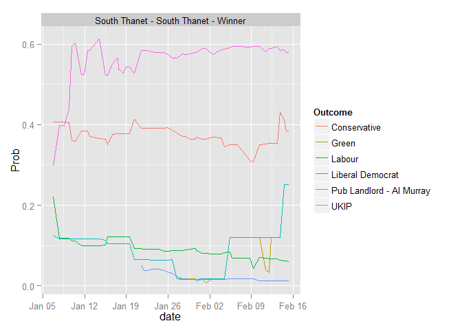
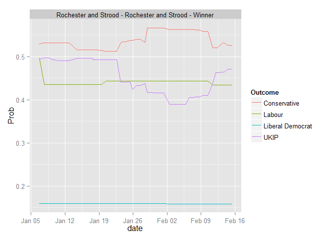
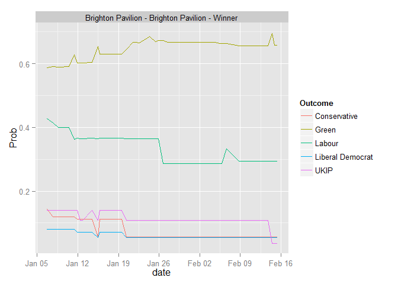
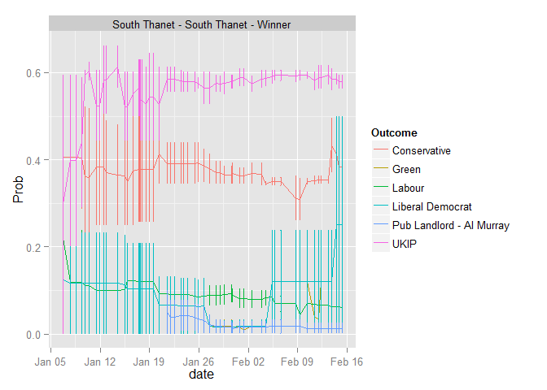
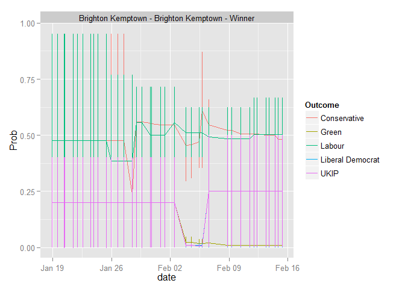
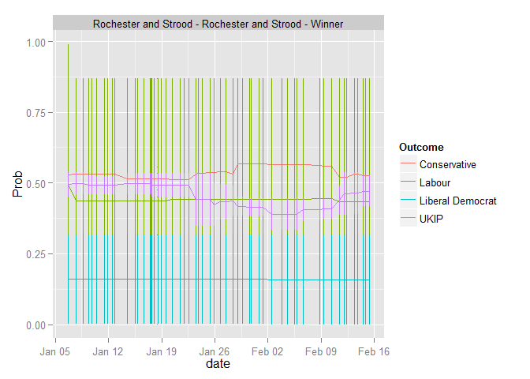
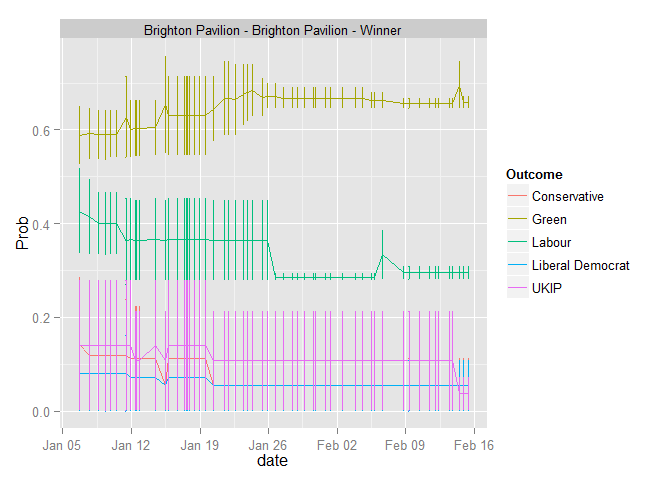

# Betfair_UKPolitics_ExploratoryAnalysis

### About

Some Exploratory Analysis of Betfair_UKPolitics_Markets.


```r
root_dir <- getwd()
setwd("./Codes/Exploratory Analysis/")
source("Markets_Name_Matched_Analysis.R")
```

```
## [1] "Libraries Loaded"
```

```r
setwd(root_dir)
```

### Number and Type of Markets


```
## [1] "# Markets = 690"
```

```
## [1] "# Constituency Markets = 650"
```

```
## [1] "# Other Markets = 40"
```

### Constituency Markets

Lots of Constituency Markets are not active yet. Just 55 (out of 650) have non-zero "Matched" value. Those are:


```r
data_matched_constituencies
```

```
##                                                                                Market
## 1                                                South Thanet - South Thanet - Winner
## 2                                      Brighton Kemptown - Brighton Kemptown - Winner
## 3                                Rochester and Strood - Rochester and Strood - Winner
## 4                                      Brighton Pavilion - Brighton Pavilion - Winner
## 5                                                            Hendon - Hendon - Winner
## 6                                        Sheffield Hallam - Sheffield Hallam - Winner
## 7                                                          Falkirk - Falkirk - Winner
## 8                                                            Gordon - Gordon - Winner
## 9                                                        Thurrock - Thurrock - Winner
## 10                                       Sutton and Cheam - Sutton and Cheam - Winner
## 11                                             Great Grimsby - Great Grimsby - Winner
## 12                                                           Yeovil - Yeovil - Winner
## 13                                         Glasgow Central - Glasgow Central - Winner
## 14                                           Great Yarmouth - Great Yarmouth - Winner
## 15                                                   Eastbourne - Eastbourne - Winner
## 16                                           Stockton South - Stockton South - Winner
## 17 Inverness Nairn Badenoch Strathspey - Inverness Nairn Badenoch Strathspey - Winner
## 18                                 East Dunbartonshire - East Dunbartonshire - Winner
## 19                             Hampstead and Kilburn - Hampstead and Kilburn - Winner
## 20                                                         Watford - Watford - Winner
## 21                                                               Hove - Hove - Winner
## 22                           Holborn and St Pancras - Holborn and St Pancras - Winner
## 23                                         Argyll and Bute - Argyll and Bute - Winner
## 24       Cities of London and Westminster - Cities of London and Westminster - Winner
## 25                                                         Clacton - Clacton - Winner
## 26                                             Cardiff North - Cardiff North - Winner
## 27                                               Glasgow East - Glasgow East - Winner
## 28                                       Portsmouth South - Portsmouth South - Winner
## 29                                                       Solihull - Solihull - Winner
## 30                                   Glasgow North East - Glasgow North East - Winner
## 31                     Mid Dorset and North Poole - Mid Dorset and North Poole Winner
## 32                                   Airdrie and Shotts - Airdrie and Shotts - Winner
## 33                                               Dudley North - Dudley North - Winner
## 34                                                       Ynys Mon - Ynys Mon - Winner
## 35                                                   Chippenham - Chippenham - Winner
## 36                                                               Bath - Bath - Winner
## 37                                     Vale of Glamorgan - Vale of Glamorgan - Winner
## 38                                               Beaconsfield - Beaconsfield - Winner
## 39                                                     Cambridge - Cambridge - Winner
## 40                                   Southampton Itchen - Southampton Itchen - Winner
## 41                                         Brigg and Goole - Brigg and Goole - Winner
## 42                                                       Broxtowe - Broxtowe - Winner
## 43                                             Isle of Wight - Isle of Wight - Winner
## 44                                                       Aberavon - Aberavon - Winner
## 45                                           Aberdeen North - Aberdeen North - Winner
## 46                                             Bradford East - Bradford East - Winner
## 47                                               Bristol West - Bristol West - Winner
## 48                             Cambourne and Redruth - Cambourne and Redruth - Winner
## 49                     Cardiff South and Penarth - Cardiff South and Penarth - Winner
## 50                                                   Ceredigion - Ceredigion - Winner
## 51                                                         Cheadle - Cheadle - Winner
## 52                                                         Halifax - Halifax - Winner
## 53                             Heywood and Middleton - Heywood and Middleton - Winner
## 54                                             Norwich South - Norwich South - Winner
## 55                           St Austell and Newquay - St Austell and Newquay - Winner
##    Matched
## 1     3049
## 2     2654
## 3     1606
## 4     1300
## 5     1000
## 6      775
## 7      672
## 8      568
## 9      327
## 10     170
## 11     150
## 12     138
## 13     102
## 14      94
## 15      81
## 16      80
## 17      70
## 18      62
## 19      61
## 20      60
## 21      59
## 22      56
## 23      52
## 24      48
## 25      40
## 26      32
## 27      30
## 28      30
## 29      26
## 30      22
## 31      22
## 32      20
## 33      20
## 34      20
## 35      14
## 36      10
## 37      10
## 38       8
## 39       8
## 40       8
## 41       6
## 42       6
## 43       5
## 44       4
## 45       4
## 46       4
## 47       4
## 48       4
## 49       4
## 50       4
## 51       4
## 52       4
## 53       4
## 54       4
## 55       4
```

```r
major_constituency_markets_history_plots_withoutErrorbar
```

```
## $`South Thanet - South Thanet - Winner`
```

 

```
## 
## $`Brighton Kemptown - Brighton Kemptown - Winner`
```

 

```
## 
## $`Rochester and Strood - Rochester and Strood - Winner`
```

 

```
## 
## $`Brighton Pavilion - Brighton Pavilion - Winner`
```

 

```r
major_constituency_markets_history_plots_withErrorbar
```

```
## $`South Thanet - South Thanet - Winner`
```

 

```
## 
## $`Brighton Kemptown - Brighton Kemptown - Winner`
```

 

```
## 
## $`Rochester and Strood - Rochester and Strood - Winner`
```

 

```
## 
## $`Brighton Pavilion - Brighton Pavilion - Winner`
```

 


### Other Markets

List of other Markets:


```r
data_matched_other
```

```
##                                                              Market
## 1                       2015 UK General Election - Overall Majority
## 2                             2015 UK General Election - Most Seats
## 3                                 UK Seat Totals - UKIP Seats Total
## 4       Prime Minister after Cameron - Prime Minister after Cameron
## 5                        2015 UK General Election - Next Government
## 6                          2015 UK General Election - Party Leaders
## 7                     Next Party Leaders - Next Conservative Leader
## 8  2015 UK General Election - Prime Minister After General Election
## 9                                    Scotland - Most Seats Scotland
## 10                              UK Seat Totals - UKIP U/O 2.5 Seats
## 11                              UK Seat Totals - UKIP Seats Total 2
## 12                Next Party Leaders - Next Liberal Democrat Leader
## 13                          Next Party Leaders - Next Labour Leader
## 14                              UK Seat Totals - SNP U/O 35.5 Seats
## 15                              UK Seat Totals - UKIP U/O 5.5 Seats
## 16                                     England - Most Seats England
## 17                   London Mayoral Election 2016 - Winner - Winner
## 18                              UK Seat Totals - SNP U/O 11.5 Seats
## 19                                  Leader Exit Dates - Ed Miliband
## 20                             UK Seat Totals - Green U/O 1.5 Seats
## 21                             UK Seat Totals - Lib Dem Seats Total
## 22                              UK Seat Totals - SNP U/O 25.5 Seats
## 23                        2015 UK General Election - Electoral Bias
## 24                       2015 UK General Election - Electoral Bias?
## 25                        UK Seat Totals - Conservative Seats Total
## 26                              UK Seat Totals - Lib Dem Under/Over
## 27                                   Leader Exit Dates - Nick Clegg
## 28                                Leader Exit Dates - David Cameron
## 29                              UK Seat Totals - Labour Seats Total
## 30                             UK Seat Totals - Green U/O 0.5 Seats
## 31                         UK Seat Totals - Conservative Under/Over
## 32           2015 UK General Election - Two General Elections 2015?
## 33                              Cabinet Exit Dates - Prime Minister
## 34                               UK Seat Totals - Labour Under/Over
## 35                                  Cabinet Exit Dates - Chancellor
## 36                         2015 UK General Election - Voter Turnout
## 37                   Northern Ireland - Most Seats Northern Ireland
## 38                                 UK Seat Totals - SNP Seats Total
## 39                                         Wales - Most Seats Wales
## 40                                   Wales - Plaid Cymru Under/Over
##    Matched
## 1   962185
## 2   919949
## 3   133371
## 4    72654
## 5    48546
## 6    33621
## 7    24483
## 8    17200
## 9    16592
## 10   13419
## 11   11434
## 12    9339
## 13    8176
## 14    4617
## 15    4545
## 16    3808
## 17    3808
## 18    3305
## 19    3011
## 20    2827
## 21    2547
## 22    2531
## 23    1996
## 24    1982
## 25    1751
## 26    1558
## 27    1277
## 28     982
## 29     478
## 30     469
## 31     238
## 32     193
## 33     105
## 34      96
## 35      40
## 36      24
## 37      11
## 38      10
## 39      10
## 40       0
```


# ternary constituencies


