# 07May_Report
## Prime Minister After General Election

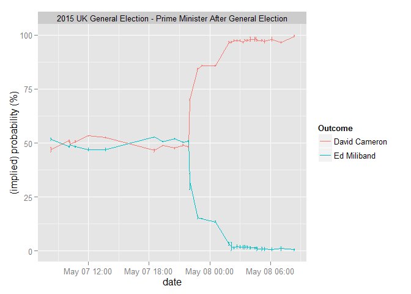 

## Next Government
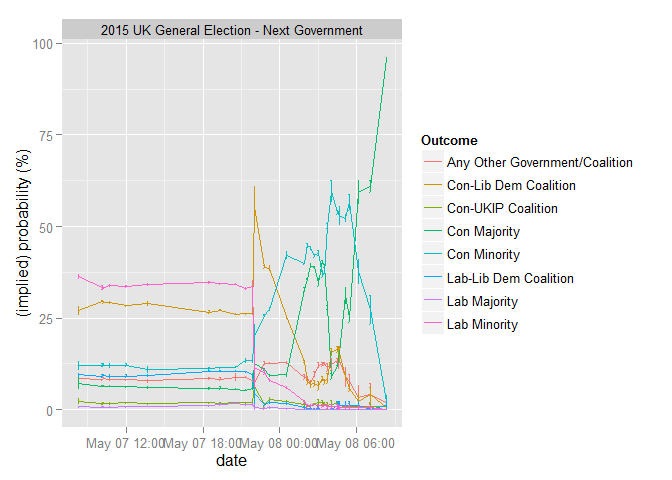 

## South Thanet
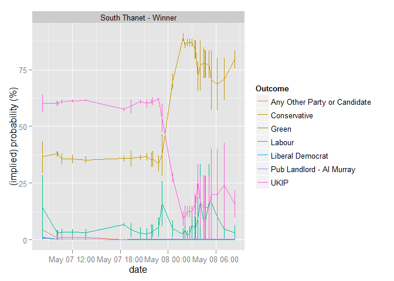 

## UKIP Seats Total
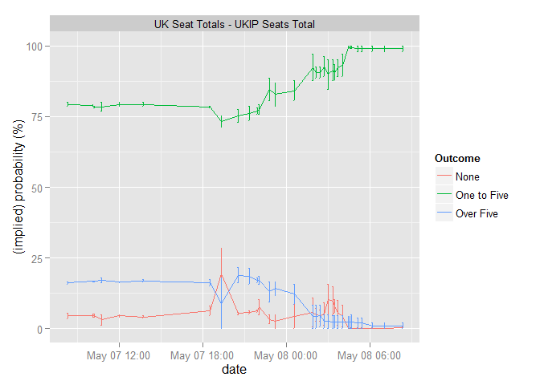 

## Overall Majority
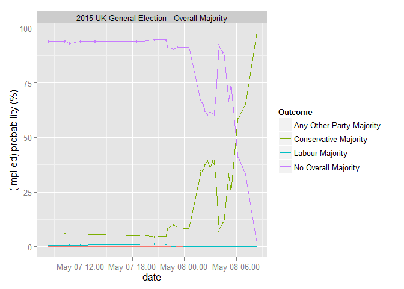 

## Most Seats
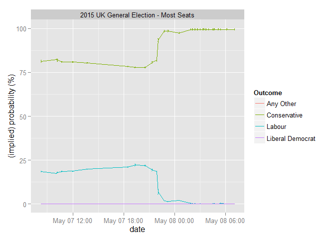 

## UKIP Under/Over 2.5 Seats
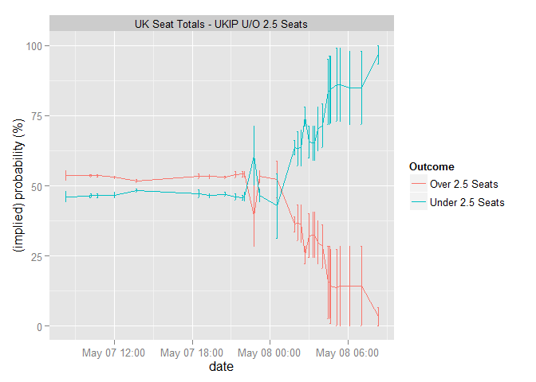 

## UKIP Seats 2
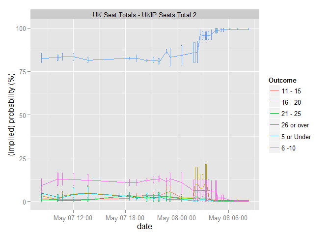 

## Conservative Seats
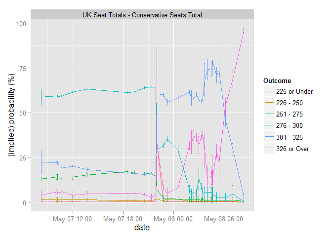 

## Lib Dem Seats
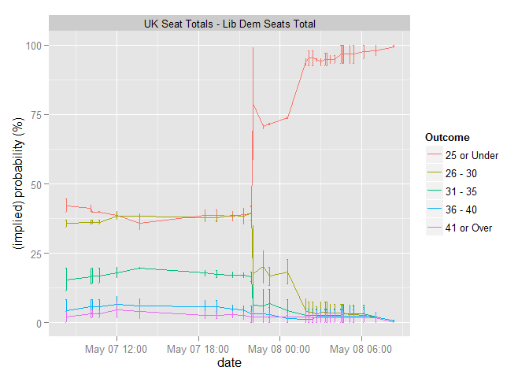 

## Electoral Bias
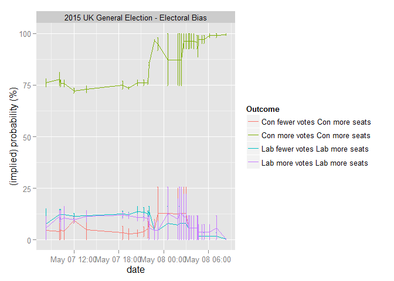 

## Labour Seats
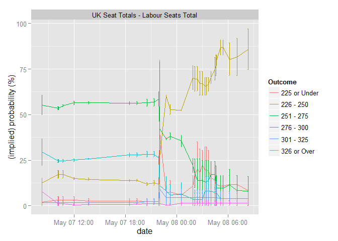 

## Voter Turnout
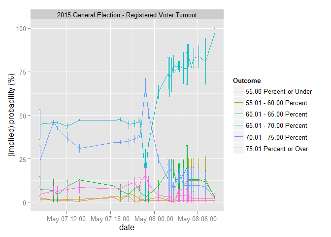 

## Two General Elections 2015?
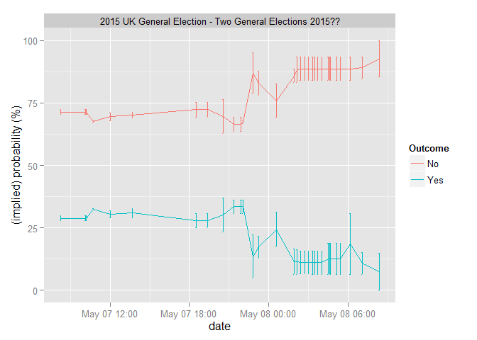 

## Conservative Under/Over 278.5 Seats
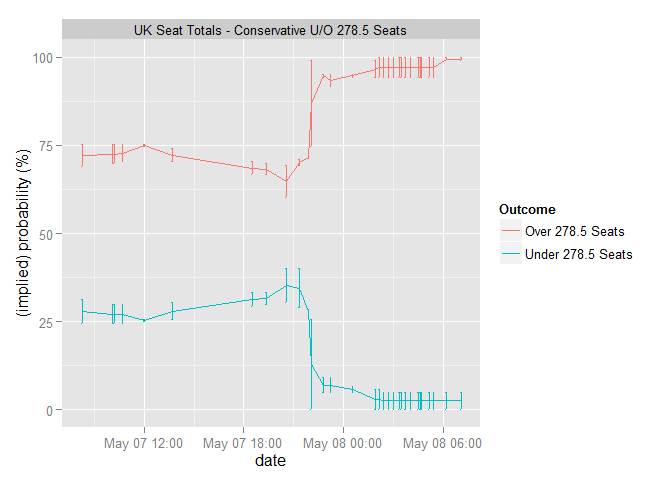 

## SNP Seats 
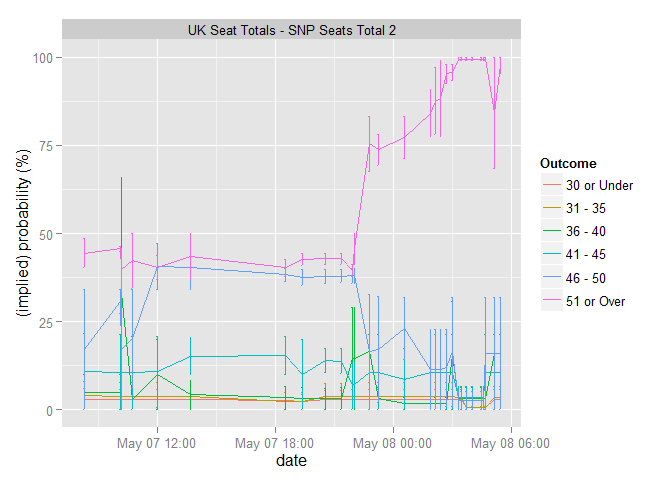 

## LibDem Seats Under/Over 32.5 Seats
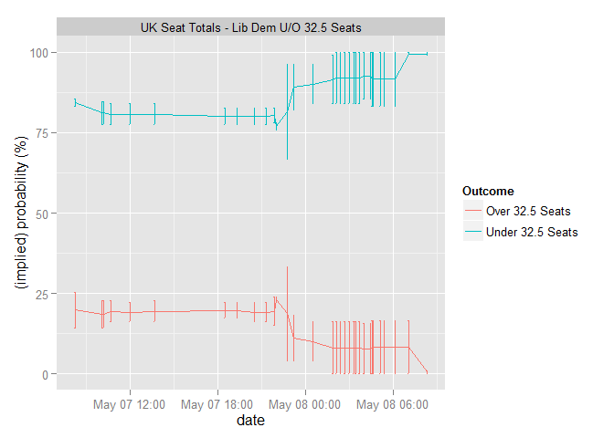 

## Conservative Seats Under/Over 287.5 Seats
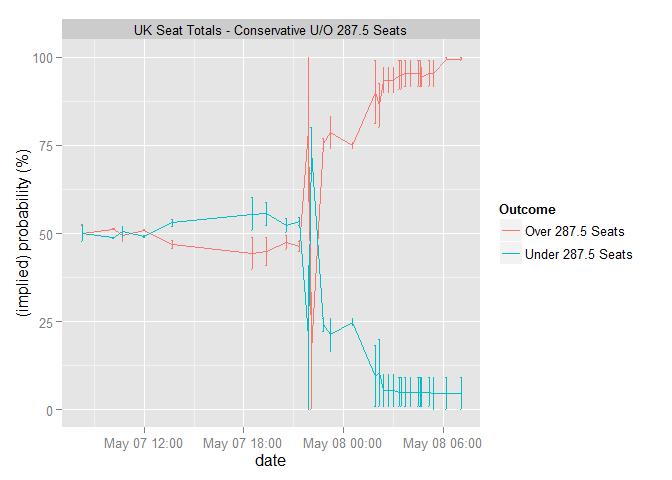 

## Labour Seats Scotland
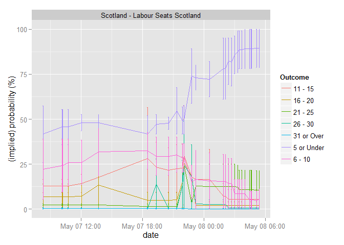 

