# Betfair_UKPolitics_ExploratoryAnalysis

## Betfair - UK Politics Markets: General

### Number and Type of Markets

- \# Markets = 744
- \# Constituency Markets = 650
- \# Other Markets = 94

### Most active Markets

|Market                                                           | Matched (£)|
|:----------------------------------------------------------------|------------:|
|2015 UK General Election - Overall Majority                      |      3531582|
|2015 UK General Election - Most Seats                            |      2442631|
|2015 UK General Election - Next Government                       |       415735|
|2015 UK General Election - Prime Minister After General Election |       319836|
|UK Seat Totals - UKIP Seats Total                                |       210507|
|Prime Minister after Cameron - Prime Minister after Cameron      |        91584|
|Scotland - Most Seats Scotland                                   |        89953|
|2015 UK General Election - Party Leaders                         |        53855|
|UK Seat Totals - UKIP U/O 2.5 Seats                              |        48908|
|UK Seat Totals - UKIP Seats Total 2                              |        44227|
|England - Most Seats England                                     |        32220|
|Next Party Leaders - Next Conservative Leader                    |        27253|
|UK Seat Totals - Conservative Seats Total                        |        24203|
|UK Seat Totals - UKIP U/O 5.5 Seats                              |        20014|
|UK Seat Totals - SNP U/O 35.5 Seats                              |        13538|
|2015 UK General Election - Next Government Coalition Parties     |        12652|
|UK Seat Totals - Lib Dem Seats Total                             |        11273|
|Next Party Leaders - Next Liberal Democrat Leader                |        10544|
|2015 UK General Election - Electoral Bias                        |        10429|
|Next Party Leaders - Next Labour Leader                          |         9131|
|UK Seat Totals - SNP U/O 43.5 Seats                              |         7901|
|2015 General Election - To Win A Seat                            |         7633|

### Most active Constituency Markets

|Market                                         | Matched (£)|
|:----------------------------------------------|------------:|
|South Thanet - Winner                          |        67590|
|Brighton Pavilion - Winner                     |        10117|
|Sheffield Hallam - Winner                      |         8414|
|Rochester and Strood - Winner                  |         6156|
|Gordon - Winner                                |         5548|
|Bristol West - Bristol West - Winner           |         4828|
|Brighton Kemptown - Brighton Kemptown - Winner |         3779|
|Cambourne and Redruth - Winner                 |         3546|
|Castle Point - Castle Point - Winner           |         3062|
|Thurrock - Winner                              |         2782|

--- 

## Market = Overall Majority

### Overall Majority: (implied) Probability vs. date

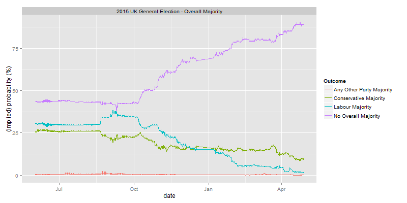

### Overall Majority: Current Probabilities

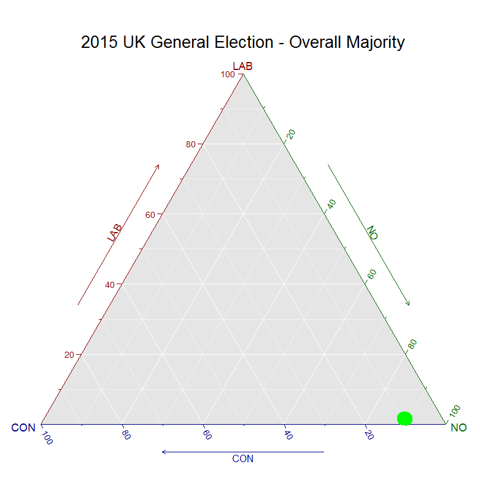

### Overall Majority: (implied) Probability vs. date (Animated GIF)

---

## Market = Most Seats

### Most Seats: (implied) Probability vs. date

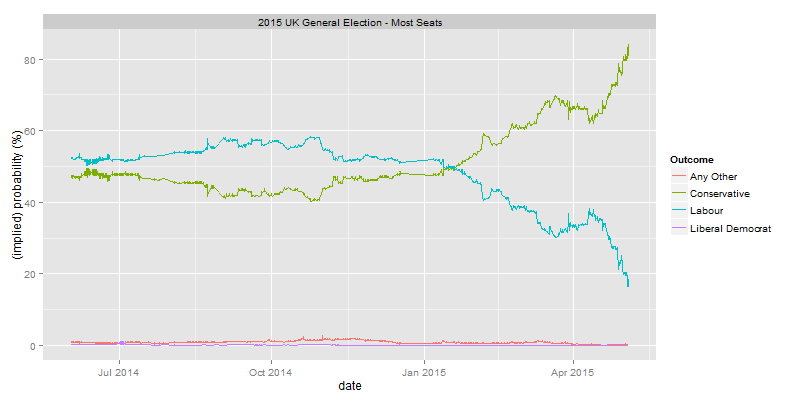

### Most Seats: Current Probabilities

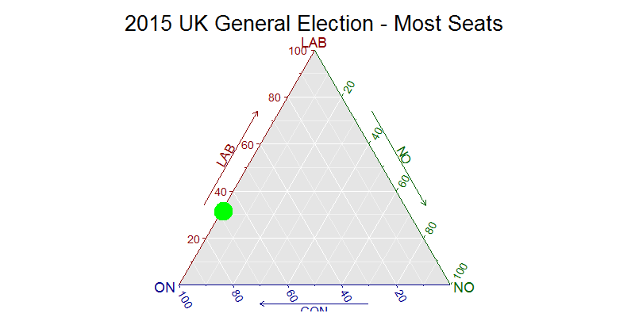

### Most Seats: (implied) Probability vs. date (Animated GIF)

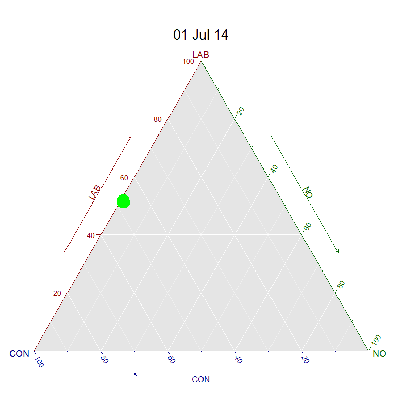

---

## Market = Next Government

### Next Government: (implied) Probability vs. date

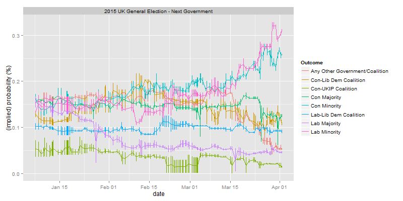

### Next Government: Current Probabilities

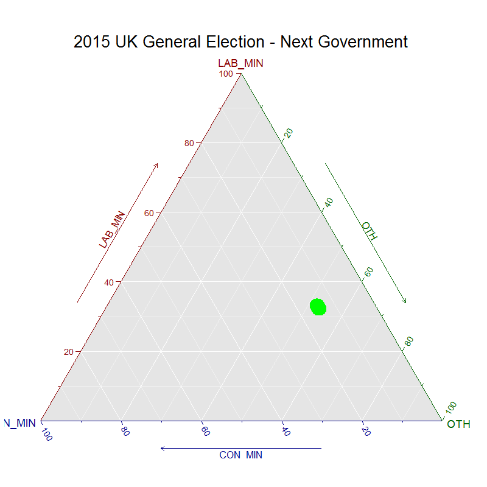

### Next Government: (implied) Probability vs. date (Animated GIF)

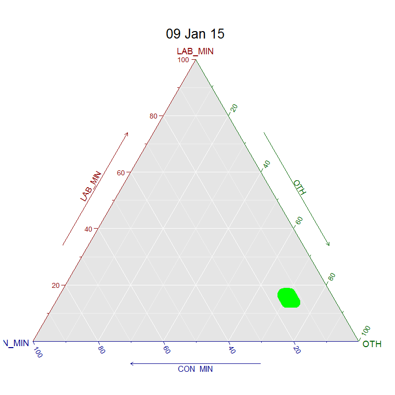

---

## Market = Prime Minister After General Election

### Prime Minister After General Election: (implied) Probability vs. date

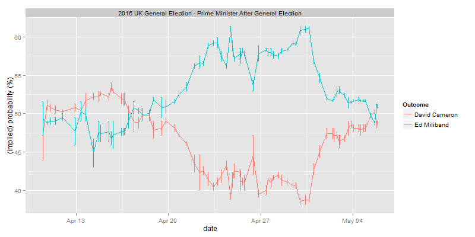

### Prime Minister After General Election: (implied) Probability vs. date (Animated GIF)

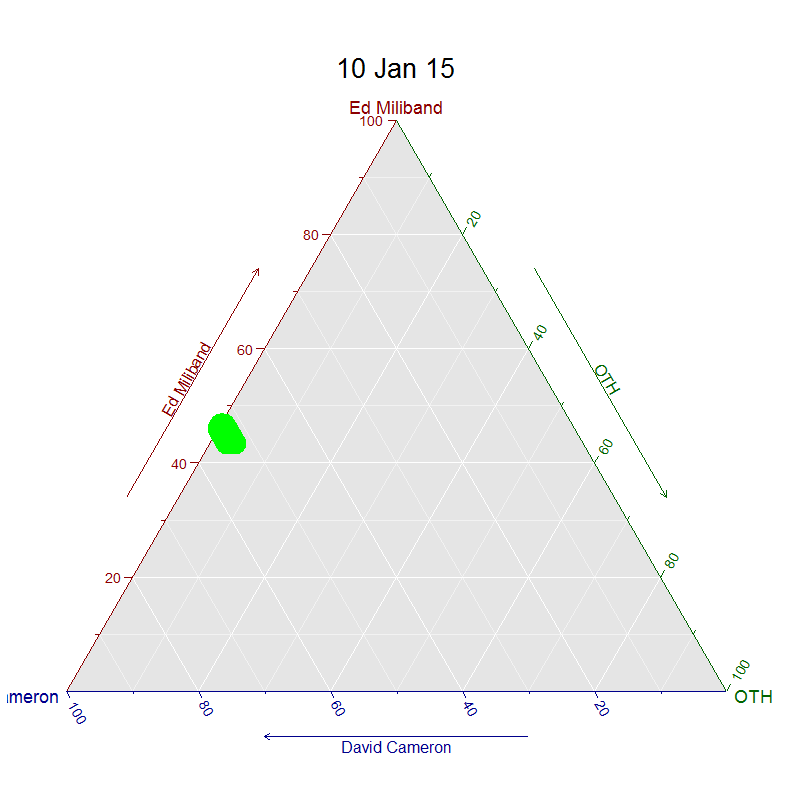

---

## Market = South Thanet

### South Thanet: (implied) Probability vs. date

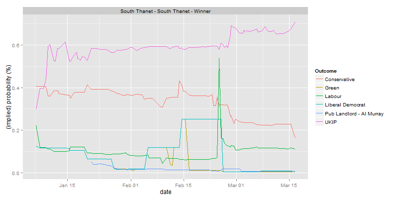

### South Thanet: Current Probabilities

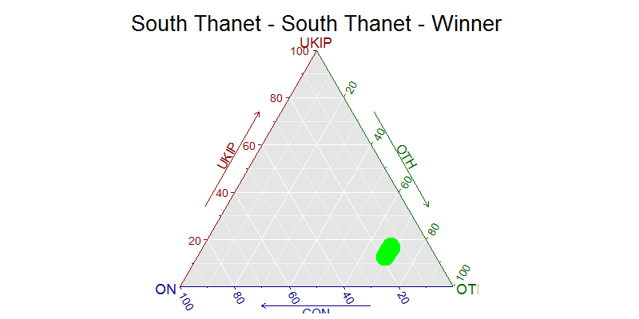

---

## Market = UKIP Seats

### UKIP Seats: (implied) Probability vs. date

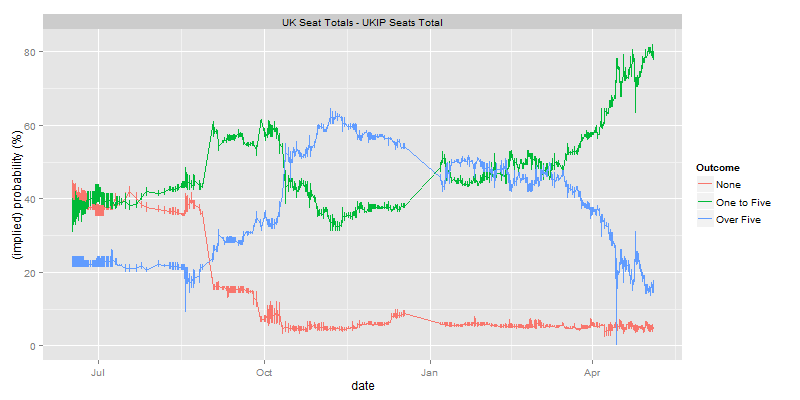

### UKIP Seats: Current Probabilities

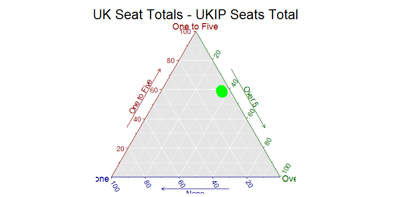

### UKIP Seats: (implied) Probability vs. date (Animated GIF)

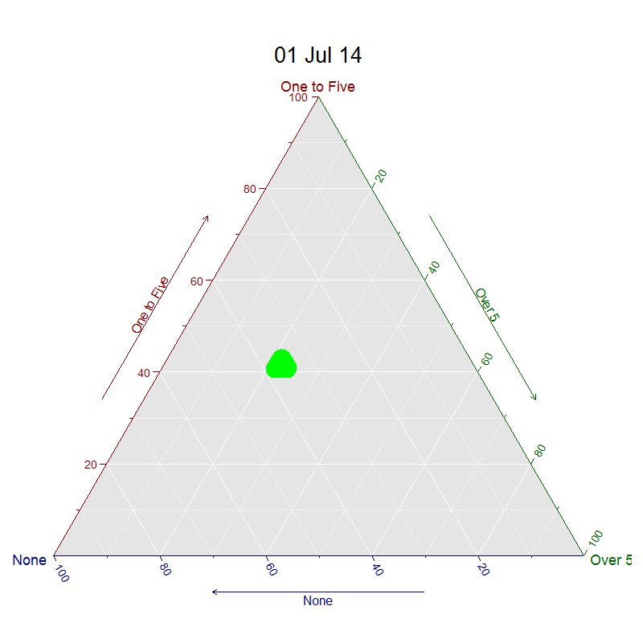

